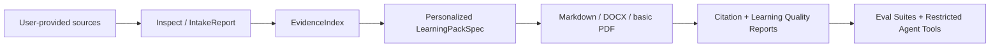

# StudyLoom / source2study

**StudyLoom** is the public project name. `source2study` is the Python package and CLI.

`source2study` is a source-grounded personalized learning pack generator. It helps users turn their own learning or work materials into traceable, personalized, reviewable study/work packs.

source2study 的第一步不是总结，而是资料保真提取。用户给 Word、PDF、PPT、视频、网页、截图、字幕或导出内容后，系统先检查和提取资料，再基于证据链生成个性化学习包。

It is not a generic video summarizer. It is not a crawler. It is not a tool for bypassing platform controls.

## Core Idea



Quality line:

```text
Source Fidelity -> Evidence Quality -> Citation Grounding -> Learning Quality -> Output Fit -> Restricted Agent Tools
```

## 3 Minute Quickstart

```bash
python -m venv .venv
.venv\Scripts\activate
pip install -e .

source2study ingest \
  --workspace ./workspace/demo \
  --source ./examples/demo_sources/notes.md \
  --source ./examples/demo_sources/mini_repo \
  --source ./examples/demo_sources/lecture.vtt

source2study build-index ./workspace/demo
source2study generate ./workspace/demo --mode beginner --output ./workspace/demo/outputs/beginner.md
source2study validate ./workspace/demo --pack ./workspace/demo/outputs/study_pack_beginner_full.json
```

Open:

- `workspace/demo/outputs/beginner.md`
- `workspace/demo/intake_report.json`
- `workspace/demo/outputs/citation_report_beginner_full.json`
- `workspace/demo/outputs/learning_quality_report_beginner_full.json`

## Why StudyLoom Exists

Many tools summarize one video or transcript. StudyLoom is designed for a different job:

- inspect user-provided materials before generation
- preserve evidence with source, location, confidence, and rights metadata
- generate different learning packs for different users and goals
- export optional source-grounded wiki and concept-map views
- verify citation grounding and learning quality
- keep agent/MCP tools restricted and auditable

The learning-pack design borrows from active recall, quizzes, flashcards, study guides, paper-to-course workflows, and compact agent skills. See [docs/personalized-learning.md](docs/personalized-learning.md), [docs/learning-mode-patterns.md](docs/learning-mode-patterns.md), and [docs/mcp-agent-tools.md](docs/mcp-agent-tools.md).

## Demos

### Standard Demo

```bash
source2study ingest \
  --workspace ./workspace/standard-demo \
  --source ./examples/demo_sources/notes.md \
  --source ./examples/demo_sources/mini_repo \
  --source ./examples/demo_sources/lecture.vtt

source2study build-index ./workspace/standard-demo
source2study generate ./workspace/standard-demo --mode beginner --output ./workspace/standard-demo/outputs/beginner.md
source2study validate ./workspace/standard-demo --pack ./workspace/standard-demo/outputs/study_pack_beginner_full.json
```

### Low-Risk Import Demo

```bash
source2study ingest \
  --workspace ./workspace/low-risk-demo \
  --source ./examples/low_risk_sources/wechat_article.html \
  --source ./examples/low_risk_sources/xhs_note.json \
  --source ./examples/low_risk_sources/zhihu_page.html \
  --source ./examples/low_risk_sources/browser_capture.json \
  --source ./examples/low_risk_sources/slide.png \
  --source ./examples/low_risk_sources/course.srt

source2study build-index ./workspace/low-risk-demo
source2study generate ./workspace/low-risk-demo --mode beginner --output ./workspace/low-risk-demo/outputs/beginner.md
```

### Personalized Learning Pack Demo

```bash
source2study ingest --workspace ./workspace/personalized-demo --source ./examples/personalized/sources
source2study build-index ./workspace/personalized-demo

source2study generate ./workspace/personalized-demo --mode beginner --profile ./examples/personalized/profiles/beginner.json --output ./workspace/personalized-demo/outputs/beginner.md
source2study generate ./workspace/personalized-demo --mode exam --profile ./examples/personalized/profiles/exam.json --output ./workspace/personalized-demo/outputs/exam.md
source2study generate ./workspace/personalized-demo --mode developer --profile ./examples/personalized/profiles/developer.json --output ./workspace/personalized-demo/outputs/developer.md
source2study generate ./workspace/personalized-demo --mode creator --profile ./examples/personalized/profiles/creator.json --output ./workspace/personalized-demo/outputs/creator.md
```

### Eval Demo

```bash
python evals/run_eval.py --suite standard_demo
python evals/run_eval.py --suite personalized_demo
python evals/run_eval.py --suite degraded_demo
```

### Wiki / MindMap Demo

```bash
source2study wiki build ./workspace/standard-demo
source2study graph export ./workspace/standard-demo --format markmap
source2study graph export ./workspace/standard-demo --format mermaid
source2study graph export ./workspace/standard-demo --format json
```

These exports are optional views over `EvidenceIndex` and `ConceptGraph`. They do not crawl Wikipedia or invent source-free wiki content.

### Template Pack Demo

```bash
source2study templates list
source2study templates show developer-project
source2study templates copy all --workspace ./workspace/standard-demo
```

## Example Outputs

Curated small samples live in [examples/outputs](examples/outputs):

- [beginner.md](examples/outputs/beginner.md)
- [exam.md](examples/outputs/exam.md)
- [developer.md](examples/outputs/developer.md)
- [creator.md](examples/outputs/creator.md)
- [degraded-warning.md](examples/outputs/degraded-warning.md)
- [intake_report_sample.json](examples/outputs/intake_report_sample.json)
- [citation_report_sample.json](examples/outputs/citation_report_sample.json)
- [learning_quality_report_sample.json](examples/outputs/learning_quality_report_sample.json)
- [eval_report_sample.json](examples/outputs/eval_report_sample.json)

## Supported Sources

| Source | Current path | Status |
|---|---|---|
| Markdown/text | local file | supported |
| PDF | local file, basic text extraction | supported with optional `pypdf` |
| DOCX | local user-provided `.docx` | supported, OpenXML text/table/comment extraction |
| PPTX | local user-provided `.pptx` | supported, OpenXML slide/speaker-note extraction |
| local GitHub-style repo | local directory | supported |
| ordinary webpage | explicit `--allow-network` only | cautious support |
| saved WeChat HTML | user-saved local HTML | supported |
| Xiaohongshu export | user-exported Markdown/JSON | supported |
| saved Zhihu HTML | user-saved local HTML | supported |
| browser capture | current-page JSON export | supported |
| screenshot OCR | image plus optional `.ocr.txt` sidecar | supported, confidence labeled |
| transcript/subtitle | `.srt`, `.vtt`, `.txt` | supported |
| Bilibili/YouTube video | user-provided transcript/screenshot only | direct download blocked by default |
| paid course platforms | user-authorized local exports only | no bypass |

See [docs/source-capability-matrix.md](docs/source-capability-matrix.md).

## Output Modes

- `beginner`: zero-base guide with prerequisites, concept cards, misconceptions, and checks
- `review`: review sheet and recall prompts
- `exam`: exam/interview definitions, traps, and questions
- `developer`: project learning path, code map, and practice tasks
- `creator`: creator/script structure with hooks and talking points
- `teacher`: lecture notes, class plan, assignment ideas
- `research`: research-oriented definitions, tensions, and extension reading

## CLI Overview

```text
source2study inspect SOURCE --workspace WORKSPACE [--source-type TYPE] [--allow-network]
source2study ingest [SOURCE ...] --workspace WORKSPACE [--source SOURCE ...] [--source-type TYPE] [--allow-network]
source2study build-index WORKSPACE [--allow-degraded]
source2study generate WORKSPACE --mode MODE --output PATH [--profile PROFILE_JSON] [--goal GOAL] [--level LEVEL] [--time-budget TIME] [--use-case USE_CASE] [--style STYLE] [--share-mode personal|public_share] [--allow-degraded]
source2study validate WORKSPACE [--pack PACK_JSON] [--share-mode personal|public_share]
source2study policy check SOURCE [--allow-network]
source2study wiki build WORKSPACE [--output-dir DIR]
source2study graph export WORKSPACE --format markmap|mermaid|json [--output PATH]
source2study ocr IMAGE [--output OCR_TXT]
source2study asr inspect [MEDIA]
source2study asr transcribe MEDIA [--output TRANSCRIPT_TXT]
source2study keyframes inspect [VIDEO]
source2study keyframes extract VIDEO --output-dir DIR [--interval-seconds N]
source2study templates list|show|copy
```

## MCP / Agent Tools

Agents can call StudyLoom only through a restricted, auditable tool surface:

- `source2study_policy_check`
- `source2study_inspect_local`
- `source2study_ingest_local`
- `source2study_build_index`
- `source2study_generate_pack`
- `source2study_generate_personalized_pack`
- `source2study_validate_pack`
- `source2study_run_eval`

Smoke check:

```bash
python mcp/server.py --list-tools
```

Default MCP behavior:

- workspace allowlist only
- network disabled
- structured errors
- redacted responses
- no large raw source text returned

See [docs/mcp-agent-tools.md](docs/mcp-agent-tools.md).

## Safety And Compliance

StudyLoom does not promise to scrape everything.

It does not accept:

- cookies or cookie replay
- login sessions or browser profiles
- private headers or tokens
- bulk account-history crawling
- paywall bypass
- DRM bypass
- anti-bot or CAPTCHA bypass
- request-signature reverse engineering
- arbitrary shell execution through agent tools
- arbitrary local file reads through agent tools
- arbitrary URL fetching through agent tools

When direct extraction is unavailable, use exported files, screenshots, browser current-page capture, transcripts, or manual notes.

See [docs/compliance.md](docs/compliance.md) and [SECURITY.md](SECURITY.md).

## Installation Notes

```bash
python -m venv .venv
.venv\Scripts\activate
pip install -e .
```

Use quoted paths when directories contain spaces:

```bash
source2study inspect "C:\Users\you\Documents\lesson notes.md" --workspace ".\workspace\demo"
```

Clean runtime files:

```powershell
Remove-Item -Recurse -Force .\workspace, .\tmp, .\.source2study -ErrorAction SilentlyContinue
```

Do not commit runtime workspaces or caches.

## Project Structure

```text
src/source2study/
  adapters/          source-specific low-risk import paths
  asr/               optional local ASR helpers
  models/            source, evidence, intake, and study-pack data models
  indexing/          EvidenceIndex and chunking
  personalization/   LearnerProfile and LearningPackSpec
  knowledge/         rule-based ConceptGraph
  generation/        writers, citation verifier, learning-quality verifier
  exporters/         Markdown, DOCX, basic PDF, wiki, and mindmap
  ocr/               sidecar/Tesseract/placeholder OCR helpers
  safety/            policy, permissions, redaction
  video/             optional local keyframe helpers
mcp/                 restricted MCP tool schemas and server
evals/               deterministic benchmark suites
examples/            demo sources, profiles, and curated outputs
skills/              Codex and Claude skill packages
templates/           blocks, personas, exporter settings, and template packs
docs/                architecture, compliance, source fidelity, roadmap
```

## Contributing

Read [CONTRIBUTING.md](CONTRIBUTING.md) before opening a PR.

New adapters must include a capability matrix entry, policy rule, fixture, tests, `IntakeReport`, evidence records with source/location/confidence, and eval coverage. A PR that only adds "can scrape this site" code is not enough.

## Known Limitations

- DOCX/PPTX extraction is OpenXML-based and conservative; complex layouts, charts, tracked changes, and image pixels are not fully reconstructed.
- Wiki/MindMap export is source-grounded but still a navigation layer, not a replacement for the evidence ledger.
- PDF export is basic; Markdown is the canonical source.
- OCR is local and optional: sidecar text first, local Tesseract if available, then low-confidence placeholder.
- ASR is local and optional through an installed `whisper` CLI; keyframes are local and optional through an installed `ffmpeg` CLI.
- Direct Bilibili/YouTube/Xiaohongshu/WeChat/Zhihu crawling is not a default feature.
- Eval metrics are deterministic rule checks, not a full human quality judgment.

## Roadmap

- `v1.0`: Public Alpha release, tag, release notes, clean install test
- `v1.1`: real DOCX/PPTX extraction - complete in this alpha line
- `v1.2`: source-grounded Wiki and MindMap extension - complete in this alpha line
- `v1.3`: browser extension hardening - complete in this alpha line
- `v1.4`: optional local OCR/ASR pipeline behind explicit permission - complete in this alpha line
- `v1.5`: template packs - complete in this alpha line
- `v2.0`: hosted or team workflows

Experimental platform adapters must keep the same low-risk, user-authorized boundaries.

## License

MIT. See [LICENSE](LICENSE).
